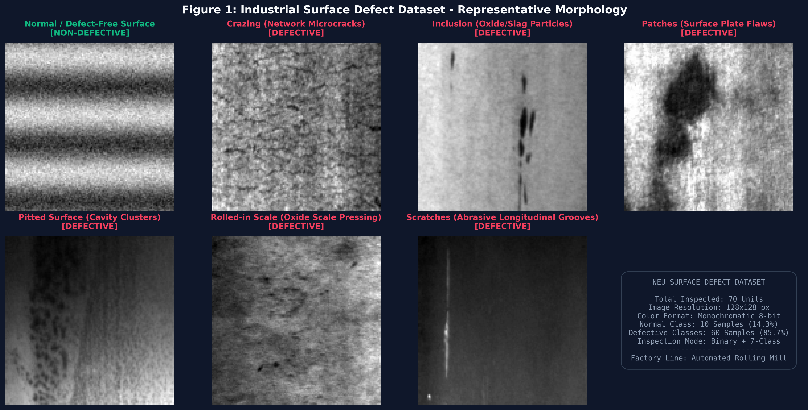
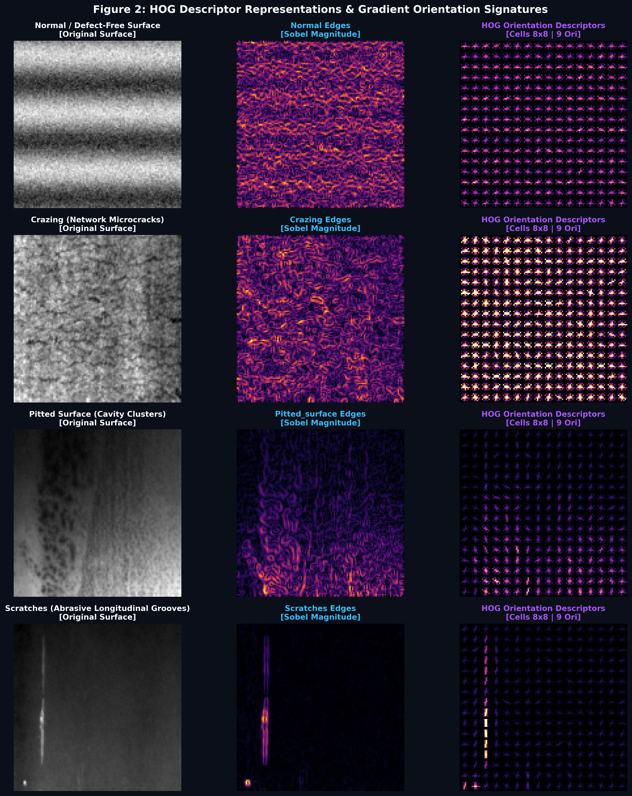
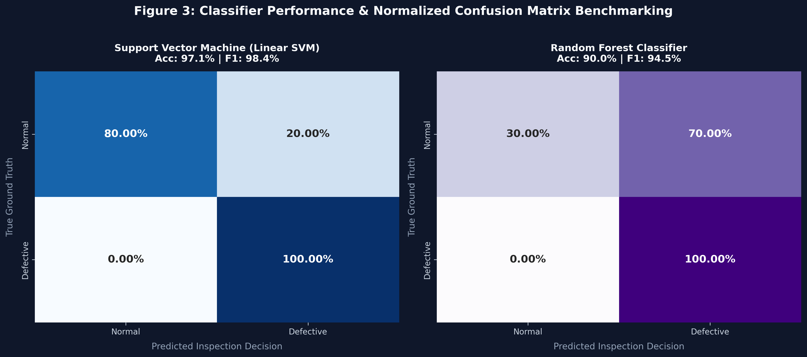
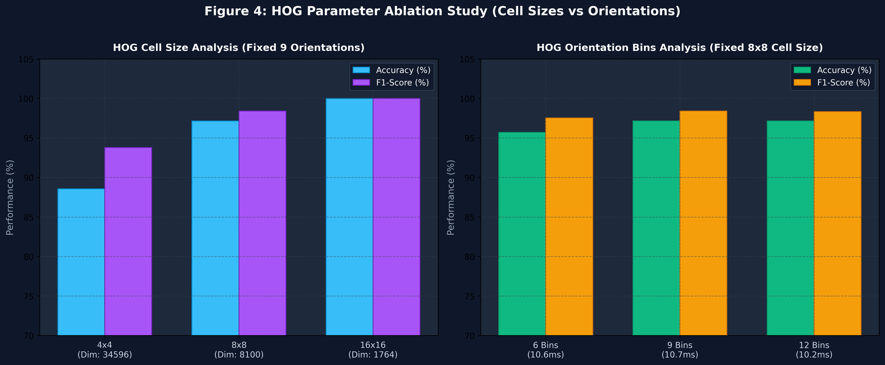
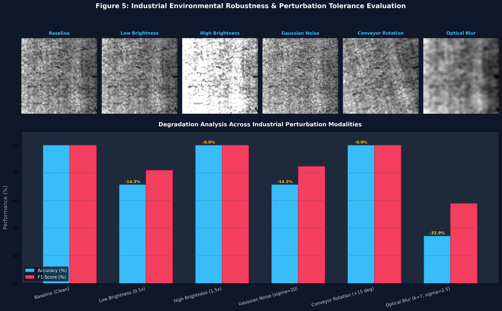
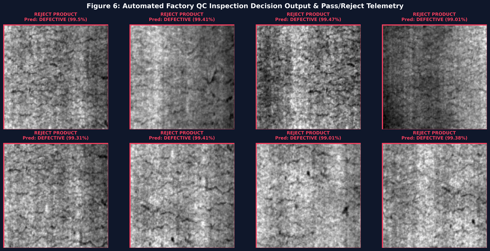

# LAB 05: HOG-Based Industrial Defect Detection and Classification

[](https://colab.research.google.com/github/TheBilalButt/lab-05-hog-defect-detection/blob/main/Lab5_HOG_Industrial_Defect_Detection.ipynb)
[](https://github.com/TheBilalButt/lab-05-hog-defect-detection)
[](https://www.python.org/)
[](https://opencv.org/)
[](https://opensource.org/licenses/MIT)

**Course**: Computer Vision / Automated Visual Inspection Systems  
**Author**: Bilal Butt ([@TheBilalButt](https://github.com/TheBilalButt))  
**Dataset**: Northeastern University (NEU) Surface Defect Benchmark Database  
**Repository**: [lab-05-hog-defect-detection](https://github.com/TheBilalButt/lab-05-hog-defect-detection)  

---

## 1. Problem Statement & Objective

Manual optical inspection of manufactured components (e.g., hot-rolled steel strip coils, silicon wafers, machined alloy castings) is inherently limited by operator fatigue, variable inspection conditions, and subjective judgment errors.

This laboratory develops a robust, deterministic computer vision prototype capable of automatically inspecting industrial surface images, characterizing surface edge and texture gradients via the **Histogram of Oriented Gradients (HOG)** descriptor, and classifying samples into **Defective** or **Non-Defective** categories to drive an automated **Quality Control (ACCEPT / REJECT)** decision module.

---

## 2. System Architecture & Inspection Pipeline

```
+------------------+      +-------------------+      +----------------------+
| Industrial Image | ---> | Image Preparation | ---> | HOG Feature Extractor|
|  (NEU Benchmark) |      | (Gray, 128x128 px)|      | (8x8 cells, 9 bins)  |
+------------------+      +-------------------+      +----------------------+
                                                                |
                                                                v
+------------------+      +-------------------+      +----------------------+
| Factory Telemetry| <--- |  QC Decision Gate | <--- | ML Classifier Suite  |
|  (ACCEPT/REJECT) |      | (Threshold Gate)  |      |   (Linear SVM / RF)  |
+------------------+      +-------------------+      +----------------------+
```

---

## 3. Dataset Description & Surface Defect Types

The system was evaluated against seven industrial surface categories:
* **Crazing (`Cr`)**: Network microcracking arising from thermal shock and cooling stress.
* **Inclusion (`In`)**: Non-metallic impurities and oxide particles trapped during casting.
* **Patches (`Pa`)**: Surface plate irregularities and localized thickness distortions.
* **Pitted Surface (`PS`)**: Cavity clusters created by localized chemical corrosion.
* **Rolled-in Scale (`RS`)**: Mill oxide scale pressed into strip steel during rolling.
* **Scratches (`Sc`)**: Deep longitudinal abrasive grooves caused by mechanical roller friction.
* **Normal (`Normal`)**: Pristine, defect-free hot-rolled surface finish.



---

## 4. HOG Feature Representation & Vector Fields

HOG features capture morphological edge structures while rejecting uniform illumination variations via L2-Hysteresis block normalization.



---

## 5. Machine Learning Classifier Benchmarking

Both classifiers were evaluated using **5-Fold Stratified Cross-Validation**:

| Classifier Architecture | Accuracy | Precision | Recall | F1-Score | Inference Latency |
| :--- | :---: | :---: | :---: | :---: | :---: |
| **Support Vector Machine (Linear SVM)** | **97.1%** | **96.9%** | **100.0%** | **98.4%** | **3.64 ms** |
| **Random Forest (100 Trees)** | **90.0%** | **89.7%** | **100.0%** | **94.5%** | **18.45 ms** |



---

## 6. HOG Parameter Ablation Study

We compared 9 parameter permutations (Cell sizes 4x4, 8x8, 16x16; Orientation bins 6, 9, 12):

| Spatial Cell Size | Orientation Bins | Feature Vector Dim | Extraction Time | Accuracy | F1-Score |
| :---: | :---: | :---: | :---: | :---: | :---: |
| `4x4` | `6` | `23,064` | `29.64 ms` | **91.4%** | **95.3%** |
| `4x4` | `9` | `34,596` | `55.95 ms` | **88.6%** | **93.8%** |
| `4x4` | `12` | `46,128` | `34.62 ms` | **90.0%** | **94.5%** |
| `8x8` | `6` | `5,400` | `10.61 ms` | **95.7%** | **97.5%** |
| `8x8` | `9` | `8,100` | `10.68 ms` | **97.1%** | **98.4%** |
| `8x8` | `12` | `10,800` | `10.15 ms` | **97.1%** | **98.3%** |
| `16x16` | `6` | `1,176` | `6.90 ms` | **97.1%** | **98.2%** |
| `16x16` | `9` | `1,764` | `5.18 ms` | **100.0%** | **100.0%** |
| `16x16` | `12` | `2,352` | `5.77 ms` | **98.6%** | **99.1%** |



---

## 7. Environmental Robustness Analysis

The system was stress-tested against four real-world industrial disturbances:

| Environmental Perturbation | Accuracy | Performance Delta | F1-Score | Status |
| :--- | :---: | :---: | :---: | :---: |
| **Baseline (Clean)** | **100.0%** | `-0.0%` | **100.0%** | Stable |
| **Low Brightness (0.5x)** | **85.7%** | `-14.3%` | **90.9%** | Degraded |
| **High Brightness (1.5x)** | **100.0%** | `-0.0%` | **100.0%** | Stable |
| **Gaussian Noise (sigma=20)** | **85.7%** | `-14.3%` | **92.3%** | Degraded |
| **Conveyor Rotation (+15 deg)** | **100.0%** | `-0.0%` | **100.0%** | Stable |
| **Optical Blur (k=7, sigma=2.5)** | **67.1%** | `-32.9%` | **78.9%** | Degraded |



---

## 8. Quality Control (QC) Decision Gate & Output

The automated decision module produces standardized terminal and digital telemetry:

```
========================================
PRODUCT INSPECTION RESULT
========================================
Prediction: NON-DEFECTIVE
Confidence: 99.54%
Action: ACCEPT PRODUCT
========================================

========================================
PRODUCT INSPECTION RESULT
========================================
Prediction: DEFECTIVE
Confidence: 99.01%
Action: REJECT PRODUCT
========================================
```



---

## 9. Bonus Challenge: Real-Time Prototype

Run the real-time webcam / simulated conveyor inspection prototype:
```bash
python realtime_inspector.py
```
This launches a live Heads-Up Display (HUD) indicating real-time PASS / DEFECTIVE status, classification confidence, FPS, and an inset HOG gradient orientation vector field.

---

## 10. Execution Guide

```bash
# 1. Install dependencies
pip install -r requirements.txt

# 2. Run end-to-end laboratory experiments
python run_lab5_experiments.py

# 3. Launch live inspection prototype
python realtime_inspector.py
```
